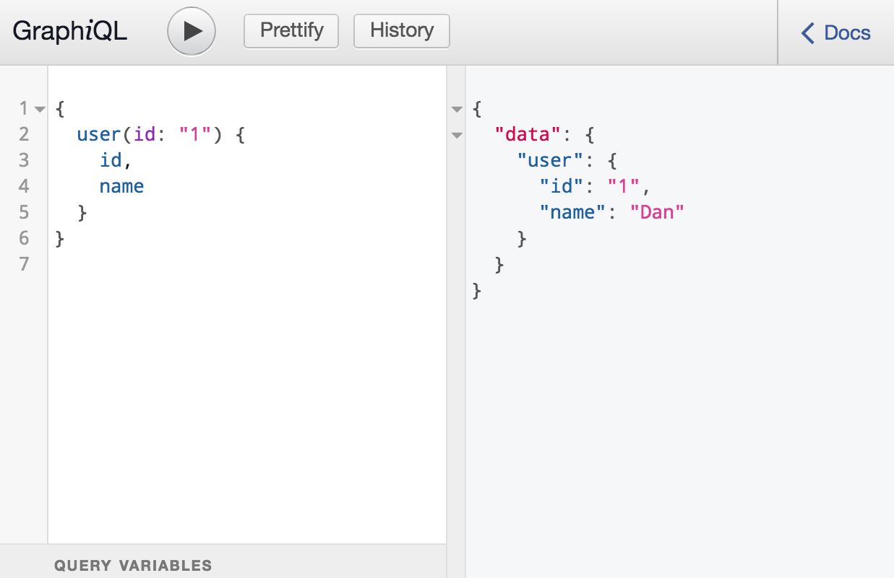

# Simple GraphQL server that also serves the GraphiQL browser IDE

This is a very simple go program that illustrates a GraphQL API. In this case our API is exposing a very simple data structure:


```go
type user struct {
	ID   string `json:"id"`
	Name string `json:"name"`
}
```

### We will define three components that will drive our API:
1) a type (userType)
2) a query (queryType)
3) a schema

### Then we will create two http handlers:
1) one to serve the API at `/graphql`
2) one to serve the GraphiQL IDE at `/` which is basically just a static web server serving from `/static`

All the code is in `main.go`.  Just clone this repo and run `go run main.go`.

Then you can run `curl -g 'http://localhost:8080/graphql?query={user(id:"1"){name}}'` to test the API.

You can also just run `http://localhost:8080` to bring up the IDE in a browser. Then paste this query in and press `>` to run it: `{user(id:"1"){name}}`



### References

[GraphQL](http://graphql.org/): GraphQL is a query language for APIs and a runtime for fulfilling those queries with your existing data. 

[graphql-go](https://github.com/graphql-go/graphql): A work-in-progress implementation of GraphQL in Go.

[GraphiQL](https://github.com/graphql/graphiql): A graphical interactive in-browser GraphQL IDE

GraphiQL is easy to install with `npm`:

```
npm install --save graphiql
```

Then copy the `graphiql.css` and `graphiql.min.js` to `\static`

```
cp ./node_modules/graphiql/graphiql.* static/
```

Get the example .html file:

```
wget 'https://raw.githubusercontent.com/graphql/graphiql/master/example/index.html' -O static/index.html
```

and then modify these two lines:

```html
<link rel="stylesheet" href="./node_modules/graphiql/graphiql.css" />
<script src="./node_modules/graphiql/graphiql.js"></script>
```

to this:

```html
<link rel="stylesheet" href="graphiql.css" />
<script src="graphiql.min.js"></script>
```

